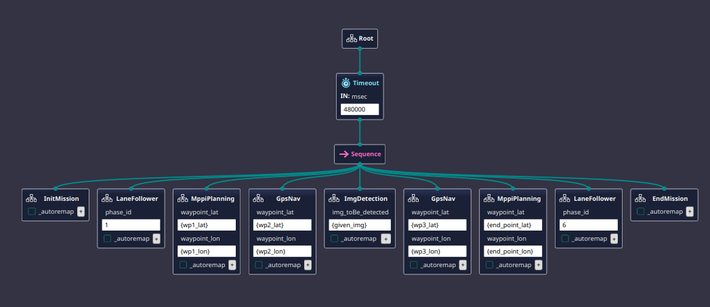

# Behavior Tree-Based Autonomous Mission Control for UGV

> **Modular, reactive mission control system using BehaviorTree.CPP v4 for autonomous ground vehicle navigation in the Unmanned Ground Vehicle Challenge (UGVC)**

---

## 📋 Project Overview

This ROS package implements a **behavior tree-based mission control system** for an autonomous ground vehicle competing in the **Unmanned Ground Vehicle Challenge (UGVC)**. The system orchestrates complex multi-phase missions including lane following, GPS waypoint navigation, MPPI (Model Predictive Path Integral) planning, image detection tasks, and recovery behaviors.

### Key Features

- **BehaviorTree.CPP v4** integration for modular, reactive decision-making
- **Multi-phase mission orchestration** with sequential and parallel execution
- **Recovery behaviors** with timeout-based fallback for each mission phase
- **GPS waypoint navigation** with configurable tolerance thresholds
- **Lane following** with obstacle detection and phase-based control
- **Image detection** with visual search and pointing actions
- **MPPI planning** for advanced trajectory optimization
- **URDF robot model** and Gazebo world integration

---

## 🎯 Mission Architecture

The main mission executes the following sequence:

<p align="center">
  
  <br>
  <em>Main behavior tree (main_bt) showing the full mission sequence and connections to all subtrees</em>
</p>

```
┌─────────────────────────────────────────────────────────┐
│                    main_bt (480s timeout)                │
├─────────────────────────────────────────────────────────┤
│                                                          │
│  1. InitMission                                         │
│     └─► Set autonomous light mode                       │
│     └─► Record current state                            │
│                                                          │
│  2. LaneFollower (Phase 1)                              │
│     └─► Reactive: follow lane until obstacle detected   │
│     └─► Recovery: lane_follower_recovery_action         │
│                                                          │
│  3. MppiPlanning → Waypoint 1                           │
│     └─► MPPI trajectory planning to GPS waypoint        │
│     └─► Recovery: mppi_recovery_action                  │
│                                                          │
│  4. GpsNav → Waypoint 2                                 │
│     └─► GPS navigation with 1.5m tolerance              │
│     └─► Recovery: gpsNav_recovery_action                │
│                                                          │
│  5. ImgDetection                                        │
│     └─► Search for target image (60s timeout)           │
│     └─► Activate pointing action (3s duration)          │
│     └─► Recovery: imgDetection_recovery_action          │
│     └─► Resume GPS nav to next waypoint                 │
│                                                          │
│  6. GpsNav → Waypoint 3                                 │
│     └─► GPS navigation to final approach                │
│                                                          │
│  7. MppiPlanning → End Point                            │
│     └─► MPPI planning to mission end                    │
│                                                          │
│  8. LaneFollower (Phase 6)                              │
│     └─► Final lane following phase                      │
│                                                          │
│  9. EndMission                                          │
│     └─► Stop rover                                      │
│     └─► Set autonomous light mode                       │
│                                                          │
└─────────────────────────────────────────────────────────┘
```

---

## 🗂 Code Structure

```
behavior_tree/
├── config/                          # ROS parameter configurations
├── include/behavior_tree/nodes/     # Custom C++ behavior tree nodes
├── launch/                          # ROS launch files
├── src/                             # C++ source files (ROS nodes)
├── urdf/                            # Robot URDF model
├── worlds/                          # Gazebo world files
├── bt4.xml                          # Main behavior tree definition (BTCPP v4)
├── Project1.btproj                  # BehaviorTree editor project file
├── CMakeLists.txt                   # CMake build configuration
├── package.xml                      # ROS package manifest
└── .gitignore
```

### Behavior Tree Nodes

**Custom Action Nodes:**
- `gps_nav_action` — Navigate to GPS coordinates with tolerance
- `lane_follow_action` — Follow lane markings (phase-based)
- `mppi_planning_action` — MPPI trajectory planning to target
- `img_search_action` — Search for target image with timeout
- `activate_pointing_action` — Activate visual pointing gesture
- `stop_rover` — Stop all motion
- `set_autonomous_light` — Control status LED mode
- `record_current_state_action` — Log current robot state

**Custom Condition Nodes:**
- `waypoint_reached` — Check if within tolerance of target GPS waypoint
- `obstacle_endPoint_detected` — Detect obstacles at end point (phase-based)

**Recovery Action Nodes:**
- `gpsNav_recovery_action` — GPS navigation recovery behavior
- `lane_follower_recovery_action` — Lane following recovery behavior
- `mppi_recovery_action` — MPPI planning recovery behavior
- `imgDetection_recovery_action` — Image detection recovery behavior

---

## 🛠 Installation &amp; Dependencies

### Prerequisites

- **ROS Noetic** (Ubuntu 20.04) or **ROS2 Humble** (Ubuntu 22.04)
- **BehaviorTree.CPP v4**
- **Gazebo** (for simulation)
- **C++17** compiler

### Installation

```bash
# Create ROS workspace (if not exists)
mkdir -p ~/catkin_ws/src
cd ~/catkin_ws/src

# Clone the repository
git clone https://github.com/heba266/behavior_tree.git

# Install BehaviorTree.CPP v4
sudo apt-get install ros-noetic-behaviortree-cpp-v3  # For ROS Noetic
# OR build from source: https://github.com/BehaviorTree/BehaviorTree.CPP

# Build the package
cd ~/catkin_ws
catkin_make  # or catkin build
source devel/setup.bash
```

---

## 🚀 Usage

### Launch the Behavior Tree

```bash
# Launch with default mission parameters
roslaunch behavior_tree mission.launch

# Launch with custom waypoint configuration
roslaunch behavior_tree mission.launch waypoints:=/path/to/waypoints.yaml
```

### Behavior Tree Editor

The `Project1.btproj` file can be opened with **Groot** (BehaviorTree.CPP visual editor):

```bash
# Install Groot
git clone https://github.com/BehaviorTree/Groot.git
cd Groot
cmake -S . -B build
cmake --build build

# Open the project
./build/Groot
# File → Load Project → select Project1.btproj
```

---

## 📊 Behavior Tree Patterns

### Reactive Sequence (Lane Following)

```xml
<ReactiveSequence>
  <Inverter>
    <obstacle_endPoint_detected phase_id="{phase_id}"/>
  </Inverter>
  <Fallback>
    <Timeout msec="40000">
      <lane_follow_action phase_id="{phase_id}"/>
    </Timeout>
    <lane_follower_recovery_action/>
  </Fallback>
</ReactiveSequence>
```

**Behavior:**
- Continuously check for obstacles at end point
- If no obstacle detected, execute lane following
- If lane following times out (40s), trigger recovery action

### Fallback with Recovery (GPS Navigation)

```xml
<Fallback>
  <Timeout msec="480000">
    <gps_nav_action lat="{waypoint_lat}" lon="{waypoint_lon}" tolerance="1.5"/>
  </Timeout>
  <gpsNav_recovery_action/>
</Fallback>
```

**Behavior:**
- Attempt GPS navigation with 8-minute timeout
- If navigation fails or times out, execute recovery behavior
- Recovery can include: re-localization, path replanning, or manual intervention request

---

## 🔧 Configuration

### Waypoint Configuration

Waypoints are passed via blackboard variables:

```yaml
# waypoints.yaml
wp1_lat: 30.123456
wp1_lon: 31.234567
wp2_lat: 30.123789
wp2_lon: 31.234890
wp3_lat: 30.124123
wp3_lon: 31.235123
end_point_lat: 30.124456
end_point_lon: 31.235456
```

### Timeout Configuration

| Mission Phase | Timeout |
|---------------|---------|
| GPS Navigation | 480 seconds (8 min) |
| Lane Following | 40 seconds |
| MPPI Planning | 40 seconds |
| Image Detection | 60 seconds |
| Main Mission | 480 seconds (8 min) |

---

## 🎮 Competition Context

This behavior tree system was developed for the **Unmanned Ground Vehicle Challenge (UGVC)**, an autonomous robotics competition that requires:

- **Autonomous navigation** through GPS waypoints
- **Lane following** on marked paths
- **Obstacle detection** and avoidance
- **Image recognition** tasks (find and point to target images)
- **Multi-phase missions** with sequential objectives
- **Robust recovery** from failures and edge cases

The modular behavior tree architecture allows rapid reconfiguration for different competition scenarios and easy debugging during testing.

---

## 🔮 Future Improvements

- [ ] Dynamic waypoint loading from mission file
- [ ] Parallel execution of perception and navigation tasks
- [ ] Integration with SLAM for indoor navigation phases
- [ ] Machine learning-based obstacle classification
- [ ] Telemetry logging and mission replay
- [ ] Web-based behavior tree monitoring dashboard

---

## 🔗 Related Projects

| Repository | Description |
|------------|-------------|
| [costmap_custom_plugin](https://github.com/heba266/costmap_custom_plugin) | Custom ROS costmap plugins for obstacle layer integration |
| [bev_cnn](https://github.com/heba266/bev_cnn) | CNN-based multi-camera Bird's-Eye-View generation |
| [bev_charuco](https://github.com/heba266/bev_charuco) | Calibration-based BEV using ChArUco boards (deprecated) |
| [hand_landmarkers_detection](https://github.com/heba266/hand_landmarkers_detection) | MediaPipe hand gesture control for robotic arm |

---

## 📚 References

1. BehaviorTree.CPP: [https://github.com/BehaviorTree/BehaviorTree.CPP](https://github.com/BehaviorTree/BehaviorTree.CPP)
2. Groot (BT Editor): [https://github.com/BehaviorTree/Groot](https://github.com/BehaviorTree/Groot)
3. ROS Behavior Tree Tutorial: [http://wiki.ros.org/behaviortree_cpp](http://wiki.ros.org/behaviortree_cpp)
4. MPPI Control: Williams et al., "Information Theoretic MPC for Model-Based Reinforcement Learning," ICRA 2017

---

## 👤 Author

**Heba El-Afifi** — Computer &amp; Communication Engineering, Alexandria University  
📧 iheba3930@gmail.com | 🐙 [github.com/heba266](https://github.com/heba266)

*Developed as part of the Alexandria University Robotics Team for UGVC competition.*

---

## 📄 License

This project is released under the MIT License.
